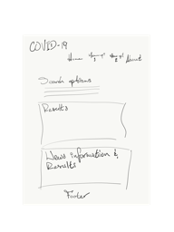

# covidTracking

## Project Checklist

## Title

Covid Tracking

## Description

Web application that allows you to see your nation's Covid statistics.

## User Story

```
AS A concerned citizen
I WANT to see my nation's statistics for Covid-19
SO THAT I can plan a trip accordingly
```

## Sketch



## API's used

- Server-side:

  - [GeoLocation](https://www.w3schools.com/html/html5_geolocation.asp)
  - [Jquery](https://jquery.com/)

- Third-Party:

  - [Chart.js](https://www.chartjs.org/samples/latest/)

- Css Framework:

## Breakdown of Tasks

Individual tasks will be delegated as they arise to allow each member to work on all aspects of the project.

## Credits

- [CDC](https://www.cdc.gov/)
